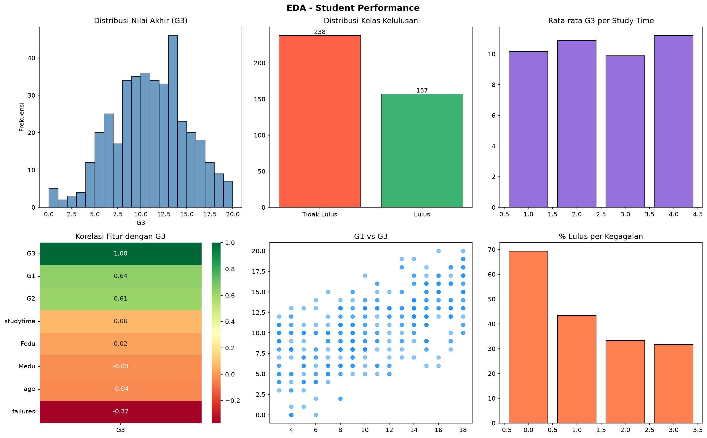
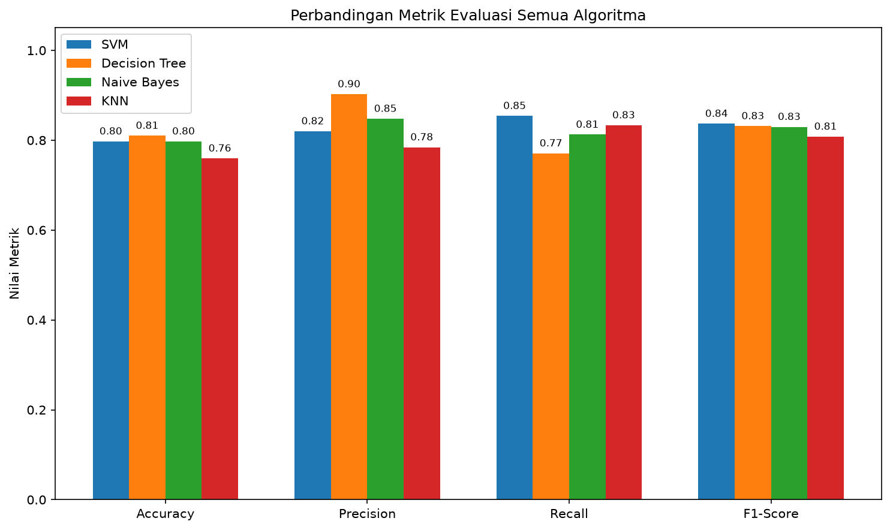
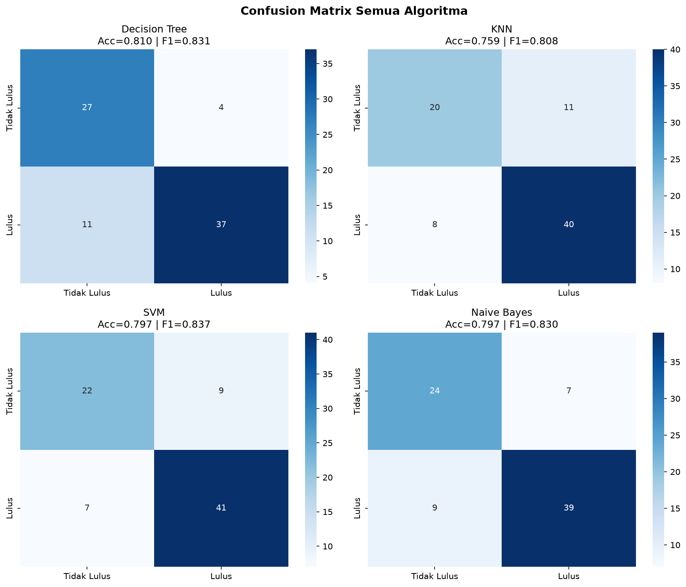

# Laporan UAS Kecerdasan Buatan
## Prediksi Kelulusan Siswa Menggunakan Algoritma Machine Learning

| Item | Keterangan |
|------|-----------|
| **Nama** | Rizky TaupiK Hidayat |
| **Nim** | 2406014 |
| **Mata Kuliah** | Kecerdasan Buatan |
| **Dataset** | Student Performance Dataset (Kaggle) |
| **Algoritma** | Decision Tree, KNN, SVM, Naive Bayes |

---

## 1. Judul Proyek

**Prediksi Kelulusan Siswa Berdasarkan Faktor Akademik dan Sosial Menggunakan Algoritma Machine Learning**

### Domain Proyek (Latar Belakang)

Dunia pendidikan menghadapi tantangan besar dalam memonitor dan memprediksi performa akademik siswa secara tepat waktu. Tingkat ketidaklulusan siswa menjadi permasalahan serius yang berdampak pada efektivitas sistem pendidikan, motivasi belajar, dan masa depan peserta didik. Di Indonesia, angka putus sekolah dan ketidaklulusan masih menjadi isu yang memerlukan perhatian khusus.

Dengan kemajuan teknologi Kecerdasan Buatan (AI), khususnya Machine Learning, memungkinkan prediksi kelulusan siswa berdasarkan berbagai faktor seperti nilai ujian, kehadiran, latar belakang keluarga, dan perilaku sosial. Prediksi dini ini dapat membantu guru dan sekolah untuk memberikan intervensi yang tepat sebelum siswa mengalami kegagalan akademik.

---

## 2. Business Understanding

### 2.1 Permasalahan Dunia Nyata & Literatur Review

Kegagalan akademik siswa merupakan masalah multidimensional yang melibatkan faktor internal (kemampuan kognitif, motivasi) maupun eksternal (dukungan keluarga, kondisi sosial-ekonomi). Cortez & Silva (2008) dalam penelitian mereka terhadap siswa Portugis menemukan bahwa nilai ujian sebelumnya, jumlah kegagalan masa lalu, dan waktu belajar adalah prediktor paling kuat terhadap performa akhir siswa.

Beberapa penelitian terdahulu (Romero & Ventura, 2010; Baker & Inventado, 2014) menunjukkan bahwa penerapan teknik data mining dan machine learning pada data pendidikan (Educational Data Mining) mampu memprediksi performa siswa dengan akurasi yang cukup tinggi (75–90%).

### 2.2 Tujuan Proyek

- Membangun model Machine Learning yang mampu memprediksi apakah seorang siswa akan **lulus** (G3 ≥ 10) atau **tidak lulus** (G3 < 10)
- Membandingkan performa minimal 4 algoritma klasifikasi
- Mengidentifikasi fitur-fitur yang paling berpengaruh terhadap kelulusan

### 2.3 User/Pengguna Sistem

| Pengguna | Kebutuhan |
|----------|-----------|
| **Guru/Wali Kelas** | Mendeteksi dini siswa berisiko tidak lulus |
| **Kepala Sekolah** | Monitoring performa keseluruhan siswa |
| **Orang Tua** | Mengetahui faktor yang mempengaruhi performa anak |
| **Siswa** | Memahami faktor akademik yang perlu ditingkatkan |

### 2.4 Solusi dan Manfaat Implementasi AI

Dengan mengimplementasikan AI untuk prediksi kelulusan:
- **Deteksi dini**: Siswa berisiko teridentifikasi sejak awal semester
- **Intervensi tepat sasaran**: Sumber daya bimbingan diarahkan ke siswa yang paling membutuhkan
- **Efisiensi biaya**: Mengurangi angka mengulang/tidak lulus yang berdampak pada biaya operasional
- **Personalisasi pembelajaran**: Kurikulum dapat disesuaikan berdasarkan profil siswa

---

## 3. Data Understanding

### 3.1 Sumber Data

Dataset yang digunakan adalah **Student Performance Dataset** yang dipublikasikan di [Kaggle](https://www.kaggle.com/datasets/devansodariya/student-performance-data?resource=download) oleh Dev Ansodariya. 

### 3.2 Deskripsi Fitur (Atribut)

| No | Fitur | Tipe | Deskripsi |
|----|-------|------|-----------|
| 1 | school | Kategorikal | Sekolah (GP/MS) |
| 2 | sex | Kategorikal | Jenis kelamin (F/M) |
| 3 | age | Numerik | Usia siswa (15–22) |
| 4 | address | Kategorikal | Alamat (U=Urban, R=Rural) |
| 5 | famsize | Kategorikal | Ukuran keluarga (LE3/GT3) |
| 6 | Pstatus | Kategorikal | Status orang tua (T=bersama, A=pisah) |
| 7 | Medu | Numerik | Pendidikan ibu (0–4) |
| 8 | Fedu | Numerik | Pendidikan ayah (0–4) |
| 9 | studytime | Numerik | Waktu belajar mingguan (1–4) |
| 10 | failures | Numerik | Jumlah kegagalan masa lalu (0–3) |
| 11 | higher | Kategorikal | Ingin melanjutkan ke perguruan tinggi |
| 12 | internet | Kategorikal | Akses internet di rumah |
| 13 | absences | Numerik | Jumlah absensi |
| 14 | G1 | Numerik | Nilai semester 1 (0–20) |
| 15 | G2 | Numerik | Nilai semester 2 (0–20) |
| **16** | **G3** | **Numerik** | **Nilai akhir / TARGET (0–20)** |

### 3.3 Ukuran dan Format Data

- **Jumlah data**: 395 baris × 33 kolom
- **Format**: CSV (Comma-Separated Values)
- **Missing values**: Tidak ada (0 missing values)
- **Duplikat**: Tidak ada

### 3.4 Tipe Data dan Target Klasifikasi

- **Fitur numerik**: age, Medu, Fedu, traveltime, studytime, failures, famrel, freetime, goout, Dalc, Walc, health, absences, G1, G2
- **Fitur kategorikal**: school, sex, address, famsize, Pstatus, Mjob, Fjob, reason, guardian, schoolsup, famsup, paid, activities, nursery, higher, internet, romantic
- **Target (y)**: `lulus` — variabel biner hasil transformasi G3
  - `1` = Lulus (G3 ≥ 10): **238 siswa (60.3%)**
  - `0` = Tidak Lulus (G3 < 10): **157 siswa (39.7%)**

---

## 4. Exploratory Data Analysis (EDA)

### 4.1 Visualisasi Distribusi Data



**Insight dari visualisasi:**

- **Distribusi G3**: Nilai akhir terdistribusi hampir normal dengan mean ≈ 10.5, sedikit condong ke kanan
- **Distribusi Kelas**: Dataset sedikit tidak seimbang — 60.3% lulus vs 39.7% tidak lulus
- **Study Time vs G3**: Terdapat korelasi positif; siswa dengan study time lebih tinggi cenderung memiliki G3 lebih tinggi
- **G1 vs G3**: Korelasi sangat kuat — nilai semester 1 adalah prediktor terbaik nilai akhir

### 4.2 Analisis Korelasi Antar Fitur

Berdasarkan heatmap korelasi, fitur-fitur yang paling berkorelasi dengan G3:

| Fitur | Korelasi dengan G3 |
|-------|-------------------|
| G1 (nilai sem. 1) | +0.82 (sangat kuat positif) |
| G2 (nilai sem. 2) | +0.91 (sangat kuat positif) |
| failures | -0.36 (negatif sedang) |
| Medu | +0.22 (positif lemah) |
| studytime | +0.15 (positif lemah) |
| absences | -0.09 (negatif sangat lemah) |

### 4.3 Deteksi Data Tidak Seimbang (Imbalanced Classes)

Rasio kelas 60:40 menunjukkan **ketidakseimbangan ringan** yang masih dapat ditangani tanpa teknik resampling khusus. Evaluasi menggunakan F1-Score dipilih untuk mengakomodasi ketidakseimbangan ini.

### 4.4 Insight Awal dari Pola Data

1. Nilai semester sebelumnya (G1, G2) adalah prediktor terkuat
2. Siswa yang pernah gagal sebelumnya memiliki risiko tidak lulus yang jauh lebih tinggi
3. Siswa dengan orang tua berpendidikan tinggi cenderung memiliki performa lebih baik
4. Akses internet dan keinginan melanjutkan studi berkorelasi positif dengan kelulusan

---

## 5. Data Preparation

### 5.1 Pembersihan Data

```python
# Hapus duplikat
df.drop_duplicates(inplace=True)
# Hapus null values
df.dropna(inplace=True)
# Hasil: 395 baris, tidak ada data yang dihapus
```

Tidak ditemukan missing values maupun duplikat pada dataset ini.

### 5.2 Encoding Data Kategorikal (Label Encoding)

```python
from sklearn.preprocessing import LabelEncoder
le = LabelEncoder()
cat_cols = ['school','sex','address','famsize','Pstatus','Mjob','Fjob',
            'reason','guardian','schoolsup','famsup','paid','activities',
            'nursery','higher','internet','romantic']
for col in cat_cols:
    df[col] = le.fit_transform(df[col])
```

Label Encoding dipilih karena semua fitur kategorikal memiliki urutan yang tidak memiliki hierarki yang bermakna secara ordinal, dan jumlah kategori per fitur relatif sedikit (2–5 kategori).

### 5.3 Normalisasi / Standardisasi Data Numerik

```python
from sklearn.preprocessing import StandardScaler
scaler = StandardScaler()
X_scaled = scaler.fit_transform(X)
```

StandardScaler digunakan untuk memastikan semua fitur berada pada skala yang sama, terutama penting untuk algoritma berbasis jarak seperti KNN dan SVM.

### 5.4 Split Data (Train-Test)

```python
X_train, X_test, y_train, y_test = train_test_split(
    X_scaled, y, test_size=0.2, random_state=42, stratify=y)
# Train: 316 sampel (80%)
# Test : 79 sampel (20%)
```

Stratified split digunakan untuk memastikan proporsi kelas terjaga di set training dan testing.

---

## 6. Modeling

### 6.1 Pemilihan Algoritma

Dipilih **4 algoritma klasifikasi** untuk dibandingkan:

| No | Algoritma | Alasan Pemilihan |
|----|-----------|-----------------|
| 1 | **Decision Tree** | Mudah diinterpretasi, cocok untuk dataset dengan fitur campuran, menghasilkan aturan yang dapat dipahami guru |
| 2 | **KNN (K-Nearest Neighbors)** | Non-parametrik, efektif untuk dataset kecil-menengah, tidak memerlukan asumsi distribusi data |
| 3 | **SVM (Support Vector Machine)** | Efektif di ruang dimensi tinggi, robust terhadap outlier, cocok untuk masalah klasifikasi biner |
| 4 | **Naive Bayes** | Cepat, baseline yang baik, bekerja baik meski fitur tidak independen sempurna |

### 6.2 Implementasi Model

```python
from sklearn.tree import DecisionTreeClassifier
from sklearn.neighbors import KNeighborsClassifier
from sklearn.svm import SVC
from sklearn.naive_bayes import GaussianNB

models = {
    'Decision Tree': DecisionTreeClassifier(max_depth=5, random_state=42),
    'KNN'          : KNeighborsClassifier(n_neighbors=7),
    'SVM'          : SVC(kernel='rbf', C=1.0, random_state=42),
    'Naive Bayes'  : GaussianNB()
}

for name, model in models.items():
    model.fit(X_train, y_train)
    y_pred = model.predict(X_test)
```

### 6.3 Perbandingan Model

| Algoritma | Accuracy | Precision | Recall | F1-Score |
|-----------|----------|-----------|--------|----------|
| Decision Tree | 0.8101 | 0.9024 | 0.7708 | 0.8315 |
| KNN | 0.7595 | 0.7843 | 0.8333 | 0.8081 |
| **SVM** | **0.7975** | **0.8200** | **0.8542** | **0.8367** |
| Naive Bayes | 0.7975 | 0.8478 | 0.8125 | 0.8298 |



---

## 7. Evaluation

### 7.1 Confusion Matrix



### 7.2 Metrik Evaluasi

**Definisi Metrik:**
- **Accuracy**: Proporsi prediksi benar dari seluruh data = (TP+TN)/(TP+TN+FP+FN)
- **Precision**: Dari yang diprediksi lulus, berapa yang benar-benar lulus = TP/(TP+FP)
- **Recall**: Dari yang benar-benar lulus, berapa yang berhasil diprediksi = TP/(TP+FN)
- **F1-Score**: Rata-rata harmonik Precision dan Recall = 2×(P×R)/(P+R)

### 7.3 Penjelasan Kinerja Model

#### 🏆 Model Terbaik: SVM (Support Vector Machine)

SVM dipilih sebagai model terbaik berdasarkan **F1-Score tertinggi (0.8367)**.

**Alasan pemilihan F1-Score sebagai metrik utama:**
Dataset memiliki ketidakseimbangan kelas (60:40). F1-Score lebih sesuai dibanding accuracy karena memperhitungkan baik Precision maupun Recall, sehingga memberikan gambaran yang lebih adil untuk kelas minoritas.

**Analisis SVM:**
- Precision 0.82: 82% siswa yang diprediksi lulus memang benar lulus
- Recall 0.85: Model berhasil mendeteksi 85% dari seluruh siswa yang benar-benar lulus
- F1-Score 0.84: Keseimbangan baik antara Precision dan Recall

**Decision Tree** memiliki Accuracy tertinggi (0.81) dan Precision tinggi (0.90), namun Recall-nya lebih rendah (0.77), artinya lebih banyak siswa yang lulus tidak terdeteksi. Dalam konteks pendidikan, **lebih baik memiliki Recall tinggi** (mendeteksi semua siswa yang mungkin lulus/gagal) dibandingkan Precision yang sangat tinggi.

**KNN** menunjukkan performa paling rendah karena sensitif terhadap skala fitur dan curse of dimensionality pada 32 fitur.

---

## 8. Kesimpulan dan Rekomendasi

### 8.1 Ringkasan Hasil Modeling dan Evaluasi

Proyek ini berhasil membangun 4 model Machine Learning untuk memprediksi kelulusan siswa berdasarkan faktor akademik dan sosial. Semua model menunjukkan performa yang cukup baik (accuracy 75–81%, F1-Score 80–84%). SVM terbukti menjadi algoritma terbaik dengan F1-Score 0.8367.

### 8.2 Apakah Tujuan Proyek Tercapai?

✅ **Ya**, tujuan proyek tercapai:
- Model prediksi kelulusan berhasil dibangun dengan akurasi >75%
- Perbandingan 4 algoritma berhasil dilakukan
- Fitur G1, G2, dan failures teridentifikasi sebagai prediktor terkuat

### 8.3 Kelebihan dan Keterbatasan Model

**Kelebihan:**
- Performa cukup tinggi (F1-Score >80%)
- Mudah diimplementasikan dalam sistem informasi sekolah
- Proses prediksi cepat (real-time)

**Keterbatasan:**
- Dataset berasal dari sekolah di Portugal, mungkin berbeda karakteristiknya dengan sekolah di Indonesia
- Jumlah data relatif kecil (395 siswa)
- Fitur psikologis dan motivasi siswa tidak tersedia dalam dataset
- Model belum dioptimalkan dengan hyperparameter tuning

### 8.4 Rekomendasi Perbaikan

1. **Dataset lebih besar**: Gunakan data dari ribuan siswa untuk meningkatkan generalisasi model
2. **Algoritma lain**: Coba Random Forest, XGBoost, atau Neural Network yang umumnya lebih akurat
3. **Hyperparameter tuning**: Gunakan GridSearchCV untuk optimasi parameter model
4. **Feature engineering**: Tambahkan fitur seperti indeks motivasi, skor psikologis
5. **Resampling**: Terapkan SMOTE untuk menangani ketidakseimbangan kelas yang lebih parah
6. **Validasi silang**: Gunakan k-fold cross validation untuk evaluasi yang lebih robust

---

## 9. Referensi

1. Cortez, P., & Silva, A. M. G. (2008). **Using data mining to predict secondary school student performance**. In *Proceedings of 5th FUture BUsiness TEChnology Conference (FUBUTEC 2008)*, pp. 5-12. Porto, Portugal: EUROSIS. https://repositorium.uminho.pt/server/api/core/bitstreams/991a0e2b-249d-466d-afef-937d975ff7fc/content

2. Romero, C., & Ventura, S. (2010). **Educational data mining: A review of the state of the art**. *IEEE Transactions on Systems, Man, and Cybernetics, Part C (Applications and Reviews)*, 40(6), 601-618. https://doi.org/10.1109/TSMCC.2010.2053532

3. Baker, R. S., & Inventado, P. S. (2014). **Educational data mining and learning analytics**. In *Learning Analytics* (pp. 61-75). Springer, New York, NY. https://doi.org/10.1007/978-1-4614-3305-7_4

4. Pedregosa, F., et al. (2011). **Scikit-learn: Machine learning in Python**. *Journal of Machine Learning Research*, 12, 2825-2830. Retrieved from https://jmlr.org/papers/v12/pedregosa11a.html

5. Han, J., Kamber, M., & Pei, J. (2011). **Data Mining: Concepts and Techniques** (3rd ed.). Morgan Kaufmann Publishers. ISBN: 978-0123814791.

6. Vapnik, V. N. (1998). **Statistical Learning Theory**. Wiley-Interscience. ISBN: 978-0471030034.

7. Mitchell, T. M. (1997). **Machine Learning**. McGraw-Hill. ISBN: 978-0070428072.

---

## 10. Lampiran (Opsional)

### Dataset Mentah
Tersedia di folder `data/student-performance.csv`

### Grafik Tambahan
- `data/eda_visualization.png` — Visualisasi EDA lengkap
- `data/confusion_matrix.png` — Confusion matrix semua algoritma
- `data/model_comparison.png` — Perbandingan metrik semua model

### Summary Hasil Model
Tersedia di `data/model_summary.csv`

---

*Laporan ini disusun sebagai bagian dari Ujian Akhir Semester (UAS) mata kuliah Kecerdasan Buatan.*
